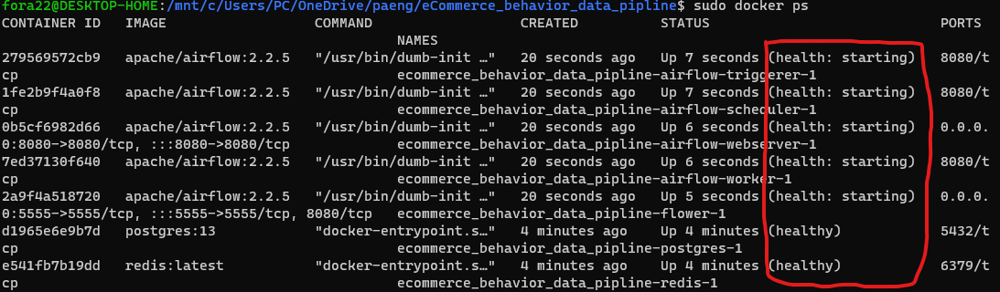

# 데이터 구성
|event_time|event_type|product_id|category_id|category_code|brand|price|user_id|user_session|
|:---:|:---:|:---:|:---:|:---:|:---:|:---:|:---:|:---:|
|string|string|int|bigint|string|string|double|int|string|
|string|string|7~8자리|최대 19자리|string|string|소수점 2자리|9자리|string|

# 환경설정
`docker-compose`를 통해 필요한 컨테이너를 생성한다.

이 프로젝트에서는 `docker-compose.yaml` 파일을 사용한다.


혹시 커스터마이징이 필요한 부분이 있으면 `docker-compose.yaml`을 살펴보고 설정해주면 된다.

이제 Airflow에서 사용할 디렉토리를 미리 설정한다.
```bash
$ mkdir ./dags ./logs ./plugins
$ echo -e "AIRFLOW_UID=$(id -u)\nAIRFLOW_GID=0\nCOMPOSE_PROJECT_NAME=fora" > .env
```
명령어를 사용하면 `dags`, `logs`, `plugins` 폴더가 생성된다.
새로운 DAG는 `dags` 폴더에, Airflow task의 로그는 `logs` 폴더에서 확인할 수 있다. 외부 플러그인은 `plugins` 폴더에 넣으면된다. 자세한 것은 [공식문서](https://airflow.apache.org/docs/apache-airflow/2.2.5/start/docker.html) 참고

### 컨테이너 띄우기
```bash
$ sudo docker-compose up airflow-init
$ sudo docker-compose up -d
```

### 결과

`localhost:8080`으로 접속하면 Ariflow 웹페이지가 나타난다. 로그인 계정은 default로 airflow / airflow 이다.


