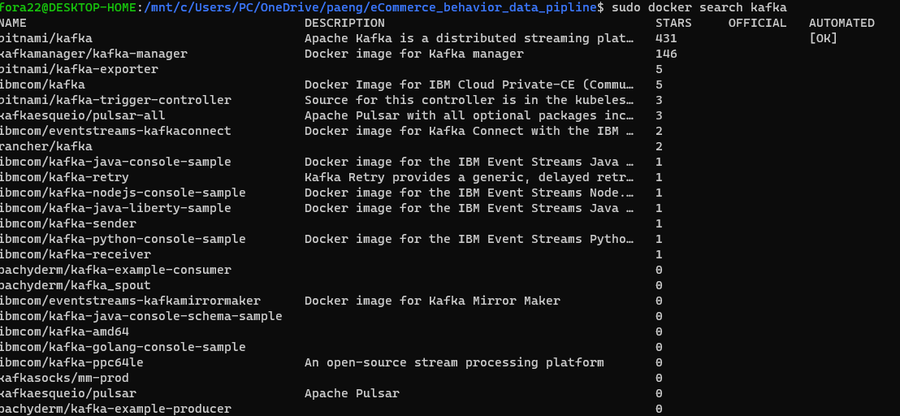

# 데이터 구성
|event_time|event_type|product_id|category_id|category_code|brand|price|user_id|user_session|
|:---:|:---:|:---:|:---:|:---:|:---:|:---:|:---:|:---:|
|string|string|int|bigint|string|string|double|int|string|
|string|string|7~8자리|최대 19자리|string|string|소수점 2자리|9자리|string|

# Kafka
kafka 이미지는 공식 버전이 없으므로 Stars가 가장 많은 이미지로 채택함


[bitnami/kafka](https://github.com/bitnami/bitnami-docker-kafka)가 가장 많았으므로 해당 이미지 선택

zookeeper의 경우 공식 이미지가 있으나 kafka를 `bitnami` 것을 사용하므로 zookeeper도 `bitnami/kafka`를 사용

# HBase
hadoop image가 같이 들어있는 [docker-hbase](https://github.com/big-data-europe/docker-hbase)를 활용한다.
`docker-compose`로 컨테이너 생성
```shell
$ git clone https://github.com/big-data-europe/docker-hbase.git

$ cd docker-hbase
$ sudo docker-compose -f docker-compose-distributed-local.yml up -d
```
